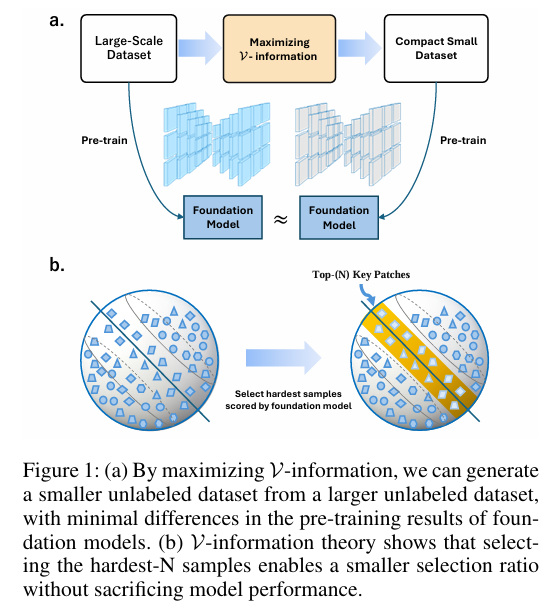

# Maximizing V-information for Pre-training Superior Foundation Models

This repo is the official implementation of ["Maximizing V-information for Pre-training Superior Foundation Models"](https://arxiv.org/abs/2408.07107).

## Abstact

Pre-training foundation models on large-scale datasets demonstrates exceptional performance. However, recent research questions this traditional notion, exploring whether an increase in pre-training data always leads to enhanced model performance. To address this issue, data-effective learning approaches have been introduced. However, current methods in this area lack a clear standard for sample selection. Our experiments reveal that by maximizing V-information, sample selection can be framed as an optimization problem, enabling effective improvement in model performance even with fewer samples. Under this guidance, we develop an optimal data-effective learning method (OptiDEL) to maximize V-information. The OptiDEL method generates hard samples to achieve or even exceed the performance of models trained on the full dataset while using substantially less data. We compare the OptiDEL method with state-of-the-art approaches finding that OptiDEL consistently outperforms existing approaches across different datasets, with foundation models trained on only 5% of the pre-training data surpassing the performance of those trained on the full dataset.

## Intorduction

Inspired by V-information theory, we frame data-effective learning task as an optimization problem of conditional entropy. It particularly emphasizes that selecting hard samples can potentially match or even surpass the performance of models trained on the full dataset while utilizing fewer data. Guided by this theory, we develop the optimal data-effective learning (OptiDEL) method, which generates harder pre-training samples from the original data and extracts critical information through the segment anything model (SAM). The key concept behind this method is to create pre-training samples with greater difficulty and more diverse information, aiming to approximate the optimal performance of a foundation model under ideal conditions.



## Citing Us

```
@misc{yang2024maximizingvinformationpretrainingsuperior,
      title={Maximizing V-information for Pre-training Superior Foundation Models}, 
      author={Wenxuan Yang and Weimin Tan and Hanyu Zhang and Bo Yan},
      year={2024},
      eprint={2408.07107},
      archivePrefix={arXiv},
      primaryClass={cs.LG},
      url={https://arxiv.org/abs/2408.07107}, 
}
```
